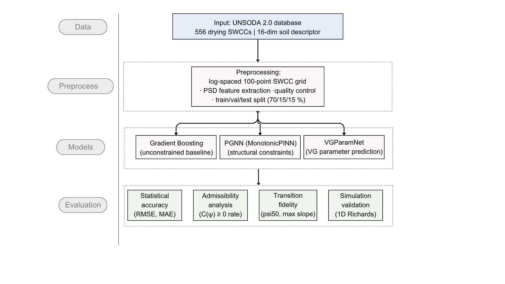

# SWCC Prediction using Physics-Informed Machine Learning

This repository contains the processed data, trained model weights, evaluation scripts, and figure-generation code for the paper:

> **"From data to physically admissible soil water retention curves: Physics-constrained machine learning for stable unsaturated flow simulation"**
> *(manuscript under review)*

[](https://doi.org/10.5281/zenodo.19656774)
[](LICENSE)
[](DATA_SOURCES.md)

---

## Framework Overview



*Fig. 1 — Integrated workflow. Drying curves from the UNSODA 2.0 database (N = 556) are preprocessed onto a common 100-point log-suction grid and used to train three model families — Gradient Boosting (GB), Physics-Guided Neural Network (PGNN), and VGParamNet — each evaluated through statistical accuracy metrics and simulation-oriented diagnostics including physical admissibility, transition-zone fidelity, and a 1D Richards equation infiltration benchmark.*

---

## Repository Structure

```
.
├── assets/                  # Figures for README
│   └── fig01.png            # Framework overview figure
├── data/processed/          # Train/val/test splits (features + SWCC curves)
├── weights/                 # Trained model weights (.keras format)
│   ├── pinn_best_model_fixed.keras   # MonotonicPINN (PGNN) — best checkpoint
│   ├── pinn_final_model_fixed.keras  # MonotonicPINN (PGNN) — final epoch
│   ├── vgparamnet_best.keras         # VGParamNet — best checkpoint
│   └── gan_final_model.keras         # WGAN-GP for synthetic data generation
├── results/
│   ├── metrics/             # Evaluation JSON files (RMSE, MAE, R², etc.)
│   └── tables/              # CSV comparison and per-sample tables
├── models/                  # Model architecture definitions
│   ├── pinn_monotonic.py    # MonotonicPINN (Physics-Guided Neural Network)
│   ├── vg_param_net.py      # VGParamNet (Van Genuchten parameter predictor)
│   ├── wgan_gp.py           # WGAN-GP for synthetic data generation
│   └── physics_constraints.py
├── training/                # GAN training scripts and config
├── training_pinn/           # PINN and VGParamNet training scripts
├── scripts/
│   ├── data_preprocessing/  # UNSODA extraction and preprocessing pipelines
│   ├── evaluation/          # Model evaluation and comparison scripts
│   ├── simulation/          # Richards equation solver and benchmark
│   └── training/            # Training monitoring utilities
├── analysis/                # Van Genuchten fitting, knee-point analysis
├── baseline_models.py       # Gradient Boosting, RF, SVM, MLP baselines
├── generate_synthetic_data.py
├── requirements_gan.txt
├── DATA_SOURCES.md          # Data provenance, download instructions
└── README.md
```

---

## Quick Start

### 1. Install dependencies

```bash
pip install tensorflow==2.17 numpy pandas scipy scikit-learn matplotlib seaborn tqdm pyyaml
```

> **Note:** Model weights were saved with TensorFlow 2.17. Using an earlier version may cause loading errors.

### 2. Load processed data

```python
import numpy as np
import pandas as pd

X_train = pd.read_csv("data/processed/X_train.csv")
y_train = np.load("data/processed/y_train.npy")        # shape: (389, 100)
suction  = np.load("data/processed/suction_grid.npy")  # 100 suction points, 0.1–1e6 kPa
```

### 3. Load a trained model and predict

```python
import tensorflow as tf

# MonotonicPINN (PGNN)
pgnn = tf.keras.models.load_model("weights/pinn_best_model_fixed.keras")

# VGParamNet
vgpnet = tf.keras.models.load_model("weights/vgparamnet_best.keras")

X_test = pd.read_csv("data/processed/X_test.csv").values
pgnn_pred   = pgnn.predict(X_test)    # shape: (84, 100), volumetric water content
vgpnet_pred = vgpnet.predict(X_test)  # shape: (84, 100), guaranteed monotone
```

### 4. Reproduce evaluation results

```bash
python scripts/evaluation/evaluate_pinn_comprehensive.py
python scripts/evaluation/evaluate_and_compare_models.py

# External validation — Bandai et al. (2023) independent soils
python scripts/evaluation/evaluate_bandai_validation.py
```

---

## Models

| Model | Weight file | Description |
|---|---|---|
| **MonotonicPINN / PGNN** | `weights/pinn_best_model_fixed.keras` | Physics-Guided Neural Network with structural monotonicity via cumulative-sum decoder |
| MonotonicPINN (final epoch) | `weights/pinn_final_model_fixed.keras` | Same training run, last epoch checkpoint |
| **VGParamNet** | `weights/vgparamnet_best.keras` | Predicts van Genuchten parameters (α, n) with softplus-bounded constraints; SWCC computed analytically — guaranteed admissible |
| **WGAN-GP** | `weights/gan_final_model.keras` | Conditional GAN for synthetic SWCC augmentation (Appendix A) |

---

## Data

Processed data splits in `data/processed/` are derived from the **UNSODA 2.0** database. See `DATA_SOURCES.md` for full provenance and download instructions for the original raw data.

| File | Description | Shape |
|---|---|---|
| `X_train/val/test.csv` | 16 soil descriptor features | (389/83/84, 16) |
| `y_train/val/test.npy` | SWCC curves (θ at 100 suction points) | (389/83/84, 100) |
| `suction_grid.npy` | Suction values in kPa (log-spaced 0.1–10⁶ kPa) | (100,) |
| `metadata.json` | Feature names, units, statistics | — |

**Features (16 total):** D10, D30, D50, D60, D90 (grain size percentiles), Cu, Cc (gradation indices), clay%, silt%, sand%, bulk density, porosity, organic matter content, pH, θs (saturated VWC), θr (residual VWC).

---

## External Validation

The paper includes two independent cross-database validation experiments:

| Dataset | N | Script |
|---|---|---|
| **GSHP** (Global Soil Hydraulic Properties, Surya et al. 2021) | 7,072 | `scripts/evaluation/evaluate_gshp_comprehensive.py` |
| **Bandai et al. (2023)** (Arizona desert soils, lab-measured) | 7 soils | `scripts/evaluation/evaluate_bandai_validation.py` |

---

## Citation

If you use this code or data, please cite:

```bibtex
@article{Avzalshoev2026,
  title   = {From data to physically admissible soil water retention curves:
             Physics-constrained machine learning for stable unsaturated flow simulation},
  author  = {Avzalshoev, Zafar and Chun, Pang-jo and Pham, Tuan A.},
  journal = {Journal of Hydrology},
  year    = {2026},
  doi     = {10.5281/zenodo.19656774}
}
```

---

## License

- **Code:** MIT License — see [LICENSE](LICENSE)
- **Processed data splits:** CC BY 4.0 — derived from UNSODA 2.0 (see [DATA_SOURCES.md](DATA_SOURCES.md) for original license)
